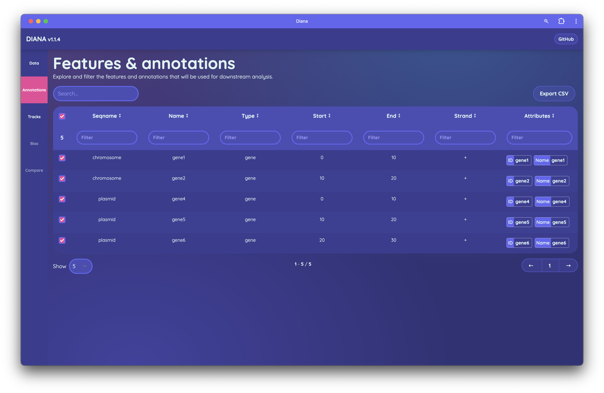
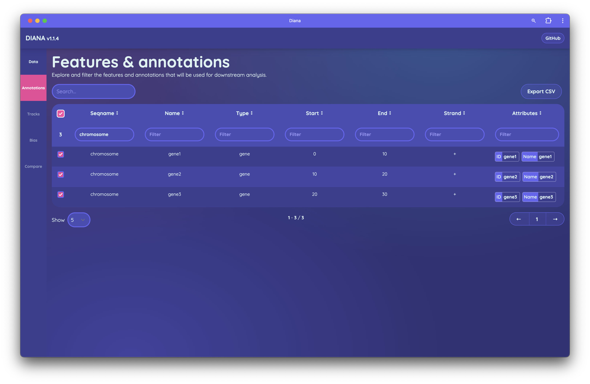

# Annotations

Explore and filter the features and annotations that will be used for downstream analysis.

## Selecting features

The selected features will be used for downstream analysis, such as differential analysis and visualisation.

The features in the annotations file can be filtered by type, name, and other attributes. To select features, use the checkboxes in the `Select` column of the table. You can also use the search bar to filter the features by name or other attributes. 

The selected features will be highlighted in the table and will be used for downstream analysis.

!!! warning

    Typically Genbank files contain both gene and CDS features so you may need to filter by type to select the features you want. Note: including duplicate features will cause the regions to be double counted in downstream analyses.