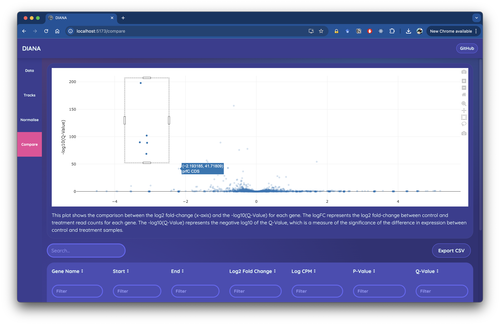

# Gene Essentiality

Diana uses the biotradis algo to perform gene essentiality testing which uses edgeR to perform differential expression analysis. The results of this analysis are visulised in a volcano plot which shows the comparison between the log2 fold-change (x-axis) and the -log10(Q-Value) for each gene. The logFC represents the log2 fold-change between control and treatment read counts for each gene. The -log10(Q-Value) represents the negative log10 of the Q-Value, which is a measure of the significance of the difference in insert counts between control and treatment samples.

Statistically essential genes (features) will be found in the top left quadrant of the plot i.e. those with much fewer inserts and significantly differences     between control and treatment samples. Selecting point on the plot will filter the associated table to only show these results.

Gene essentiality is a powerful analyses that can tell us which genes are essential for survival under different environmental conditions. 

