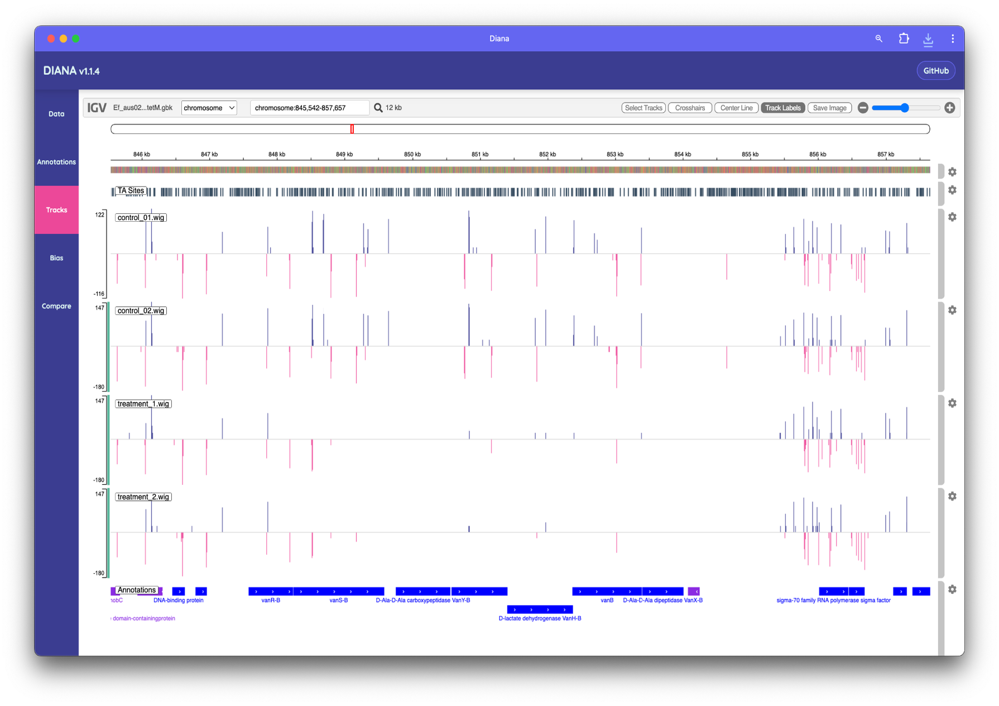

# Insert tracks

The simplest way to visualise TIS data is using a insert count plot. This plot shows the number of insertions at each position in the genome. The insert count plot is useful for identifying regions of the genome that are enriched or depleted for insertions, which can indicate important functional elements such as genes or regulatory regions.

Diana uses the JavaScript version of the [integrative genomics viewer](https://igv.org/doc/igvjs/#) (IGV) to visualise the insert count data.

The IGV interface in Diana allows you to navigate the genome and view the insert count data. Count data is displayed as bar plots, with the height of the bars representing the number of insertions at each position in the genome. Inserts on the positive strand are shown above the x-axis, and inserts on the negative strand are shown below the x-axis.

Here we can qualitatively see the difference in inserts in the Van genes between a treatment and control dataset ([Krause et al. (2025)](https://journals.asm.org/doi/10.1128/spectrum.00628-25))

IGV is a powerful tool for visualising genomic data with many features and options to customise the display. For more information on how to use IGV, see the [IGV documentation](https://igv.org/doc/desktop/#UserGuide/navigation/).
